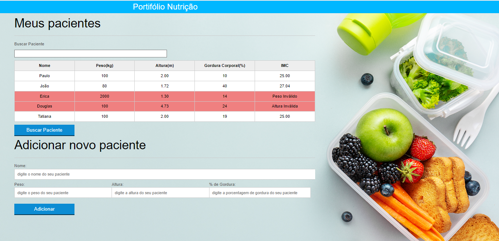

# Portifólio - Nutrição

   

### Tópicos 

- [Descrição do projeto](#descrição-do-projeto)

- [Funcionalidades](#funcionalidades)

- [Aplicação](#aplicação)

- [Ferramentas utilizadas](#ferramentas-utilizadas)

- [Acesso ao projeto](#acesso-ao-projeto)

- [Abrir e rodar o projeto](#abrir-e-rodar-o-projeto)

- [Desenvolvedores](#desenvolvedores)

## Descrição do projeto 

Projeto desenvolvido para o portifólio pessoal, e com o propósito do aprendizado na linguaguem de programação JavaScript (JS).

O projeto tem como finalidade fazer cálculos IMC de forma automática do paciente cadastrado, e como também posso cadastrar o paciente e o cálculo será exposto instantâneamente. 

Podemos tambem excluí e filtrar o paciente e trazer mais cadastros através do modelo AJAX.

 

## Funcionalidades

✅ `Funcionalidade 1:` Cadastrar o paciente e fazer os seus cálculos IMC.

✅ `Funcionalidade 2:` Listar os pacientes já cadastrados.

✅ `Funcionalidade 3:` Fazer uma buscar por pacientes através do modelo AJAX e filtrar os pacientes por nome.

✅ `Funcionalidade 4:` Deletar caso o paciente esteja repetido ou cadastrado errado.

## Aplicação

  

 
 ###

## Ferramentas utilizadas

 |  |  |

###

## Acesso ao projeto

Você pode [acessar o código fonte do projeto](https://github.com/Gilson1992/portifolio-nutricao) ou [baixá-lo](https://github.com/Gilson1992/portifolio-nutricao/archive/refs/heads/main.zip).

## Abrir e rodar o projeto

* Pode Também você mesmo acessar o projeto e fazer os seus testes através do Github Pages

     [https://gilson1992.github.io/portifolio-nutricao/](https://gilson1992.github.io/portifolio-nutricao/)

## Desenvolvedores

[ Gilson Souza](https://github.com/Gilson1992)
